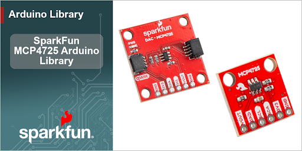

SparkFun MCP4725 Arduino Library
========================================

The SparkFun MCP4725 Arduino Library provides full control over Microchip's MCP4725, a 12-bit single-channel I2C digital-to-analog converter (DAC). The MCP4725 is compatible with SparkFun's Qwiic connect system, so no soldering is required to get started. An onboard EEPROM allows the device to retain its DAC value and power-down settings across power cycles, making it ideal for applications that require a consistent analog output at startup.

This library is available in the Arduino Library Manager; search for **SparkFun MCP4725**.

This library allows you to:

* Set a 12-bit DAC output value (0–4095)
* Use fast-mode writes for high-speed waveform generation
* Persist DAC values and power-down settings to onboard EEPROM
* Read back the current DAC register and EEPROM contents
* Configure three power-down modes (1 kΩ, 100 kΩ, and 500 kΩ load to GND)

Repository Contents
-------------------

* **/examples** - Example sketches for the library (.ino). Run these from the Arduino IDE.
* **/src** - Source files for the library (.cpp, .h).
* **/documents** - Datasheet for the MCP4725.
* **keywords.txt** - Keywords from this library that will be highlighted in the Arduino IDE.
* **library.properties** - General library properties for the Arduino package manager.

Documentation
--------------

* **[Hookup Guide](TODO)** - Hookup guide for the SparkFun MCP4725 breakout boards.
* **[Installing an Arduino Library Guide](https://learn.sparkfun.com/tutorials/installing-an-arduino-library)** - Basic information on how to install an Arduino library.
* **[Hardware GitHub Repository - Qwiic 1x1](TODO)** - Main repository (including hardware files) for the SparkFun Qwiic MCP4725 Breakout.
* **[Hardware GitHub Repository - Breakout](TODO)** - Main repository (including hardware files) for the SparkFun I2C DAC Breakout.

Products That Use This Library
---------------------------------

* [[TODO: SKU]](https://www.sparkfun.com/sparkfun-qwiic-12-bit-dac-breakout-mcp4725.html) - SparkFun Qwiic 12-Bit DAC Breakout - MCP4725
* [[TODO: SKU]](https://www.sparkfun.com/sparkfun-i2c-dac-breakout-mcp4725.html) - SparkFun I2C DAC Breakout - MCP4725

License Information
-------------------

This product is _**open source**_!

Please review the LICENSE.md file for license information.

If you have any questions or concerns on licensing, please contact support@sparkfun.com.

Distributed as-is; no warranty is given.

- Your friends at SparkFun.
